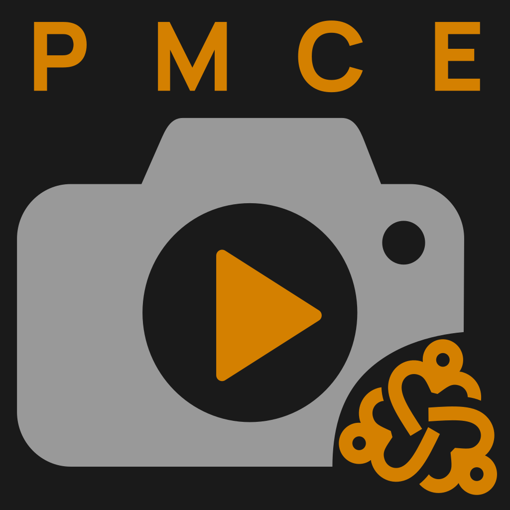

<p align="center">
  
</p>

<h1 align="center">Play Memories Community Edition (PMCE)</h1>

A community effort to revive Sony PlayMemories camera features that were abandoned by Sony. This monorepo contains a TypeScript USB protocol library and a desktop GUI that let you read camera info and install apps onto Sony cameras.

Continuation of [Sony-PMCA-RE](https://github.com/ma1co/Sony-PMCA-RE).

## Packages

| Package | Location | Description |
|---------|----------|-------------|
| `pmce-usb-interface` | `pmca-device-usb-interface/` | TypeScript library for Sony camera USB communication via WebUSB |
| `pmce` | `pmce-app/` | Quasar + Electron desktop GUI built on the USB library |

## Features
- **Camera info** — Read model name, serial number, firmware version, lens info, and GPS data range
- **App installation** — Install APK files onto the camera via the Sony app install protocol

## Confirmed cameras

Compatibility is community-reported. A badge shows how well each model works based on user reports:

 fully working (info + app install) ·
 some features work ·
 no reports yet

| Camera | Status | Notes |
|--------|--------|-------|
| ILCE-6000 |  | Dev's own camera aka 'It works on my machine' | 

> **Tried PMCE with your camera?** Please tell us, whether it worked or not, by opening a
> [camera compatibility report](https://github.com/phn-cloudsnake/pmce/issues/new?template=camera_compatibility.yml).
> Successful reports are just as valuable as failures. Confirmed models get added to the table above.

## Future development 
Currently I have no intention supporting these features in the near future. That might change with enough community support.
- **Firmware updates** — Parse DAT firmware files and write them to the camera
- **GPS assist upload** — Upload GPS assist data for faster location lock
- **Live streaming config** — Read and write streaming service and social media settings
- **WiFi AP management** — Read and write stored WiFi access point entries
- **SPK ↔ APK conversion** — Convert between Sony's SPK format and standard APK
- **Backup parsing** — Read and validate camera backup data

## Architecture

The USB library implements a layered protocol stack:

```
PmcaDevice (high-level API: info + install)
    ├── SonyExtCmdProtocol (camera commands)
    ├── SonyUpdaterProtocol (reads firmware/lens version for info)
    └── SonyAppInstallProtocol (app installation)
            │
        MtpDriver (PTP/MTP transport)
            │
        WebUsbBackend (USB I/O)
```

The desktop GUI (`pmce-app`) is a Quasar (Vue 3 + Pinia) application packaged with Electron. It consumes the USB library as a workspace dependency.

## Requirements

- Node.js ≥ 22
- PNPM (workspace monorepo manager)
- A WebUSB-capable environment (Electron / Chromium) for USB runtime use
- A Sony camera with PlayMemories support

## Getting Started

```bash
pnpm install          # Install all workspace dependencies
pnpm run build        # Build all packages
pnpm run test         # Run all tests
pnpm run dev:gui      # Start the desktop GUI in Electron dev mode
```

### Walkthrough for non-technical users
If you feel adventerous and everything in this file sounds like magic, check out the walkthrough I added for more step-by-step instructions to build the app from this repo.

## USB Library Usage

```typescript
import { PmcaDevice } from 'pmce-usb-interface';

const camera = await PmcaDevice.connect();
const info = await camera.info();
console.log(info.modelName, info.firmwareVersion);
await camera.disconnect();
```

## Development

```bash
# Full monorepo
pnpm run build                          # Build all packages
pnpm run test                           # Test all packages
pnpm run lint                           # Lint all packages

# USB library only
pnpm run build:lib
pnpm run test:lib
pnpm --filter pmce-usb-interface run test:coverage

# Desktop GUI only
pnpm run dev:gui                        # Electron dev server with hot reload
pnpm run build:gui                      # Package the desktop app
```

### Test Frameworks

- **USB library**: [Vitest](https://vitest.dev/) with [fast-check](https://fast-check.dev/) for property-based testing

## Project Structure

```
pmce/
├── pnpm-workspace.yaml
├── package.json                  # Root scripts
├── pmca-device-usb-interface/    # USB protocol library (pmce-usb-interface)
│   └── src/
│       ├── codecs/               # SPK codec (wraps APK → SPK for install)
│       ├── protocol/             # MTP driver, ExtCmd, Updater, App Install
│       ├── transport/            # WebUSB backend
│       ├── utils/                # Struct utilities
│       └── test-utils/           # Mock USB device for tests
└── pmce-app/                     # Quasar + Electron desktop GUI (pmce-app)
    └── src/
        ├── App.vue
        ├── layouts/
        ├── pages/
        ├── router/
        ├── stores/               # Pinia stores (camera state)
        └── composables/
```

## Status

This project is under active development. The core USB protocol stack is implemented and tested. The desktop GUI is under active development.
